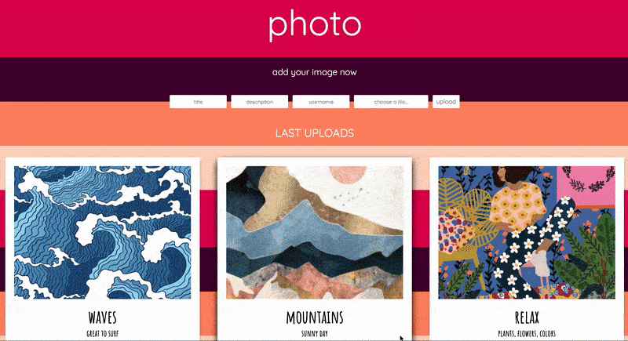
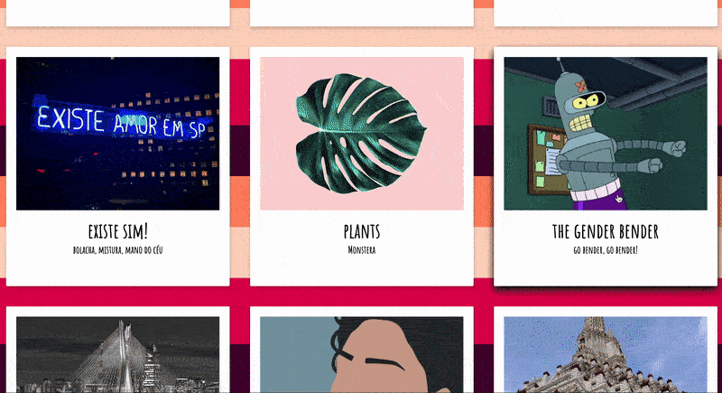

# about

Retrato was created thinking of people who travel, live and explore different places and cultures of the world.
Retrato is where these people can share their experiences through pictures in a simple, easy, fast and enjoyable way.

# features

## home

Users are greeted with a landing page that allows them to upload a picture. They can also see all previous pictures available.


## uploading an image

Users can upload a picture of their choice adding a title and description.


## making a comment

Users can add a comment in any picture. The user name and comment will be displayed in the comments area.



## scrolling

Users are invited to scroll to all the pictures and see the other comments available.



# technologies

- Javascript
- Handlebars
- Node.js
- Express.js
- PostgreSQL
- Vue.js
- AWS S3

# instructions

you need an AWS account to run the imageboard.

1.  clone repository

    ```bash
    git clone https://github.com/ingriddorioschulze/imageboard
    cd imageboard
    ```

2.  install dependencies

    ```bash
    npm install
    ```

3.  setup database

    you need PostgreSQL at least version 9 and your system user needs to be able to access the server without a password.

    ```bash
    createdb imageboard
    cd sql
    psql -d imageboard -f images.sql
    psql -d imageboard -f comments.sql
    ```

4.  create S3 bucket and credentials

    go to the AWS console and create a S3 bucket in the eu-west-1 region.

    the bucket name needs to be exchanged in the s3.js file with the one you created.

    in AWS IAM create security credentials for a user that can write to the new bucket and put the access key and secret into a file called secrets.json.

    ```json
    {
      "AWS_KEY": "YOUR AWS KEY",
      "AWS_SECRET": "YOUR AWS SECRET"
    }
    ```

5.  start the application

    ```bash
    npm start
    ```

    now go to http://localhost:8080 in your browser

# coming soon features

- previous and next picture buttons
- new picture uploaded notification
- reply comment
- responsive design
- delete image

# credits

Images:

- Personal Archive Pictures
- Google Images
- Pinterest
